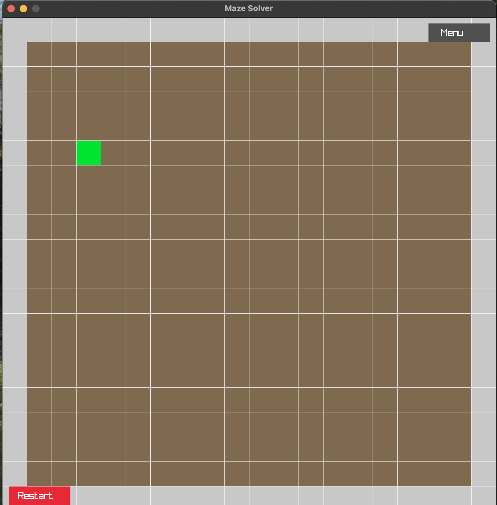
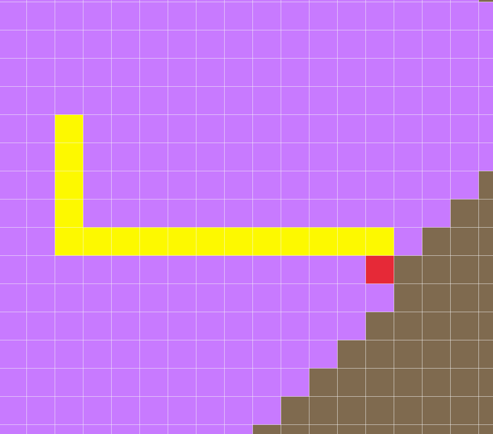

# 🧩 Maze Solver in C (with Raylib + cJSON)

An interactive maze builder and solver built with **Raylib** in C, using **Breadth-First Search (BFS)** to find and visualize the shortest path in a 2D grid.

---

## 🧠 About the Project

This project is an educational tool and demonstration of how to:

- Build a fully interactive **grid system**
- Apply **BFS pathfinding** with real-time visual feedback
- Handle **UI logic** such as buttons and dropdowns
- Serialize grid data using **JSON with `cJSON`**
- Modularize C code into a scalable architecture

It’s a hands-on example of combining **algorithmic logic** with **low-level graphics programming** and **file I/O** — perfect for learning or showcasing systems-level development.

---

## 🔧 Features

- ✅ Mouse-based maze builder
- ✅ Place **start**, **goal**, and **walls**
- ✅ Visual BFS with:
  - **Visited cells** (gray)
  - **Best path** (yellow)
- ✅ Menu system with:
  - Save to JSON
  - Load from JSON
  - Reset maze
- ✅ Full pause when menu is open

---

## 🛠️ Skills Demonstrated

| Area                  | Details                                                         |
|-----------------------|-----------------------------------------------------------------|
| C Programming         | Structs, pointers, dynamic memory, header-based modular design  |
| Algorithms            | BFS traversal with custom queue and trace-back path             |
| Raylib Graphics       | Grid rendering, UI, and mouse input handling                    |
| Serialization         | Save/load maze as JSON using `cJSON`                            |
| Software Design       | Game loop control, state management, pause/resume logic         |
| File I/O              | Cross-platform read/write with file checks and folder creation  |

---

## 📸 Screenshots

### 🟩 Start and Goal Placement  

### 🚀 BFS Running  

## 🎮 Controls

| Action            | Key / Mouse         |
|-------------------|---------------------|
| Place Start       | First left click    |
| Place Goal        | Second left click   |
| Place Wall        | After placing start & goal |
| Run BFS           | `SPACE`             |
| Open Menu         | Click top-right     |
| Save Maze         | Menu > Save         |
| Load Maze         | Menu > Load         |
| Restart Maze      | Bottom-left button  |

---

